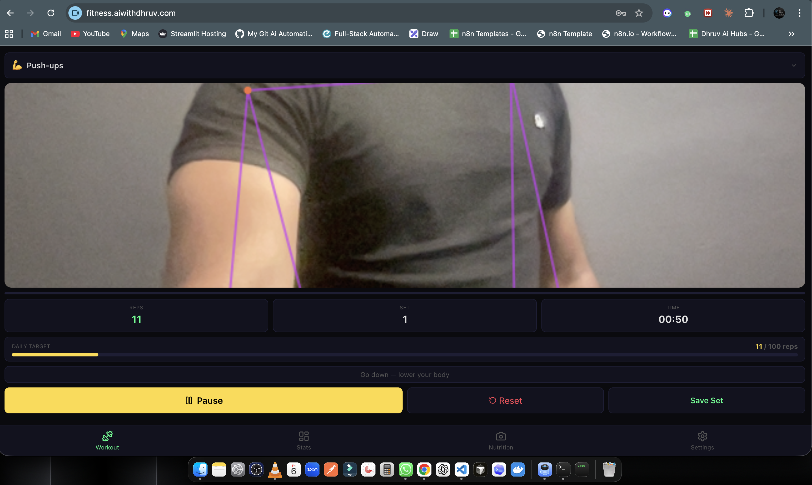
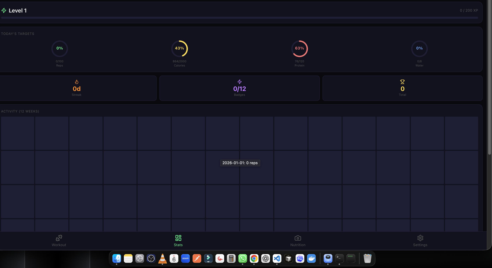
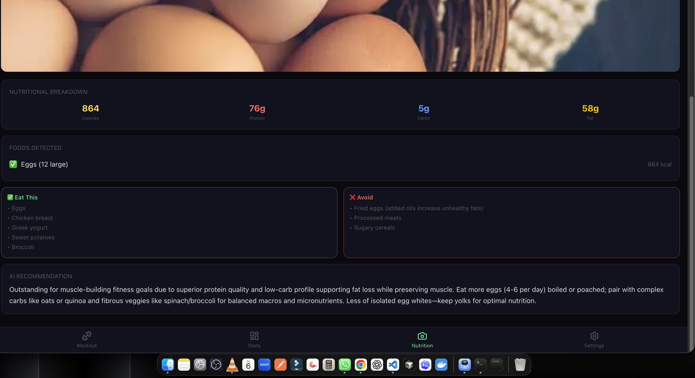
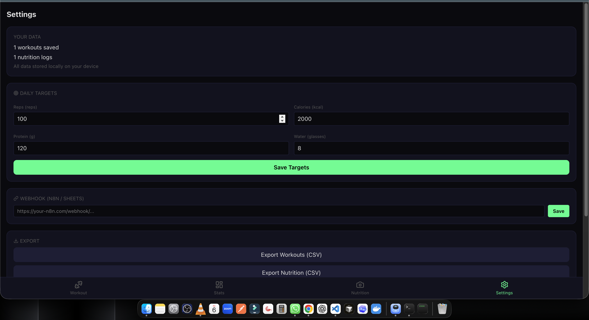
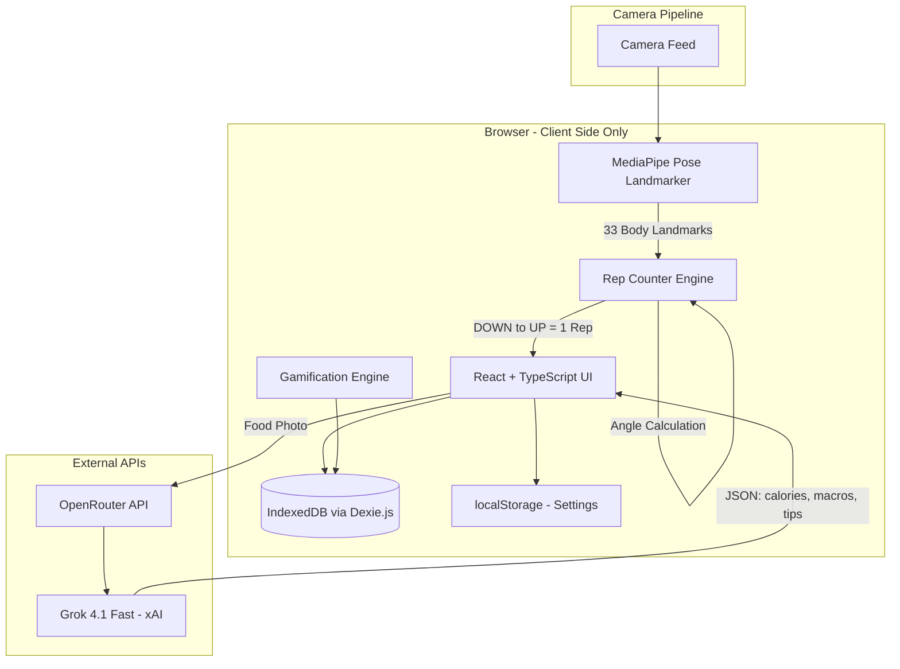
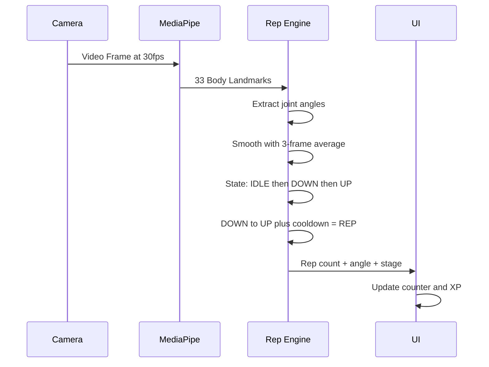

# FitTrack AI

AI-powered fitness tracker that counts exercise reps using your camera and analyzes food photos for nutrition data. No wearables needed — just your phone or laptop.

  

**Live:** [fitness.aiwithdhruv.com](https://fitness.aiwithdhruv.com)

## Screenshots

| Workout (AI Pose Detection) | Dashboard & Targets |
|:--:|:--:|
|  |  |

| Food Scanner (AI Analysis) | Settings & Export |
|:--:|:--:|
|  |  |

## What It Does

| Feature | How It Works |
|---------|-------------|
| **Rep Counting** | Camera tracks your body joints via MediaPipe AI — counts push-ups, squats, sit-ups automatically |
| **Food Scanner** | Take a photo of your meal, AI analyzes calories, protein, carbs, fat + gives eat/avoid recommendations |
| **Daily Targets** | Set rep, calorie, protein, water goals — track progress with visual rings |
| **Gamification** | XP system, 12 badges, streaks, levels — stay motivated |
| **Activity Heatmap** | 12-week GitHub-style contribution grid for workouts |
| **Export** | CSV export for workouts and nutrition logs |
| **Offline** | PWA — install on phone, works without internet |

## Architecture



## Rep Counting Pipeline



## Tech Stack

| Layer | Technology | Why |
|-------|-----------|-----|
| **Framework** | React 19 + TypeScript | Type-safe, component-based |
| **Styling** | Tailwind CSS 4 | Utility-first, dark theme |
| **Build** | Vite 7 | Fast HMR, tree-shaking |
| **AI Pose** | MediaPipe Tasks Vision (Lite) | Browser-native, GPU-accelerated, no server |
| **AI Food** | Grok 4.1 Fast via OpenRouter | Vision model, fast, accurate JSON output |
| **Storage** | IndexedDB (Dexie.js) | Local-first, no backend needed |
| **PWA** | vite-plugin-pwa + Workbox | Offline caching, installable |
| **Hosting** | Cloudflare Pages | Free, edge CDN, unlimited bandwidth |

## Project Structure

```
fittrack-ai/
├── src/
│   ├── engine/
│   │   ├── rep-counter.ts     # Angle calc, smoothing, state machine
│   │   ├── exercises.ts       # Exercise definitions (joints, angles)
│   │   └── gamification.ts    # XP, levels, streaks, 12 badges
│   ├── pages/
│   │   ├── Workout.tsx        # Camera feed + rep counting
│   │   ├── Dashboard.tsx      # Stats, targets, heatmap, badges
│   │   ├── Nutrition.tsx      # Food photo analysis via AI
│   │   └── Settings.tsx       # Targets, webhook, export, data
│   ├── components/
│   │   └── NavBar.tsx         # Bottom navigation
│   ├── db/
│   │   └── index.ts           # Dexie.js IndexedDB schema
│   ├── App.tsx                # Router
│   ├── main.tsx               # Entry point
│   └── index.css              # Theme variables + animations
├── index.html
├── vite.config.ts             # Vite + PWA + Tailwind config
└── package.json
```

## Quick Start

```bash
git clone https://github.com/aiagentwithdhruv/fittrack-ai.git
cd fittrack-ai
npm install
npm run dev
```

## Setup

1. **Camera**: Allow camera access when prompted (for rep counting)
2. **Food Scanner**: Get a free API key from [OpenRouter](https://openrouter.ai/keys) → Settings → paste key
3. **Daily Targets**: Settings → set your rep/calorie/protein/water goals
4. **Install as App**: Click "Install" in browser address bar (PWA)

## Exercises Supported

| Exercise | Joints Tracked | Down Angle | Up Angle |
|----------|---------------|------------|----------|
| Push-ups | Shoulder → Elbow → Wrist | 90 | 155 |
| Squats | Hip → Knee → Ankle | 90 | 160 |
| Sit-ups | Shoulder → Hip → Knee | 70 | 140 |

## Gamification

- **XP**: 100 per workout + 2 per rep + 20 bonus (>30 reps) + streak multiplier
- **Levels**: Level N requires N x 200 XP
- **12 Badges**: First 5, Half Century, Century Club, Iron Will, Machine, Hat Trick, Week Warrior, Iron Habit, Regular, Dedicated, Rising Star, Elite
- **Streaks**: Consecutive workout days with multiplier (1.1x per day, max 2x)

## Cost

| Component | Cost |
|-----------|------|
| Hosting (Cloudflare Pages) | Free |
| Pose Detection (MediaPipe) | Free (runs locally) |
| Food Analysis (Grok via OpenRouter) | ~$0.20/1M tokens |
| **Total monthly (typical use)** | **< $0.05/month** |

## Roadmap

- [ ] More exercises (pull-ups, lunges, planks)
- [ ] Voice coaching during workout
- [ ] Water tracking with tap counter
- [ ] Workout plans and programs
- [ ] Cloud sync (Supabase)
- [ ] BLE device integration (heart rate, ESP32)
- [ ] Social features (challenges, leaderboards)

## License

MIT

---

Built with MediaPipe + React + Grok AI. No backend. No subscription. Just your camera.
